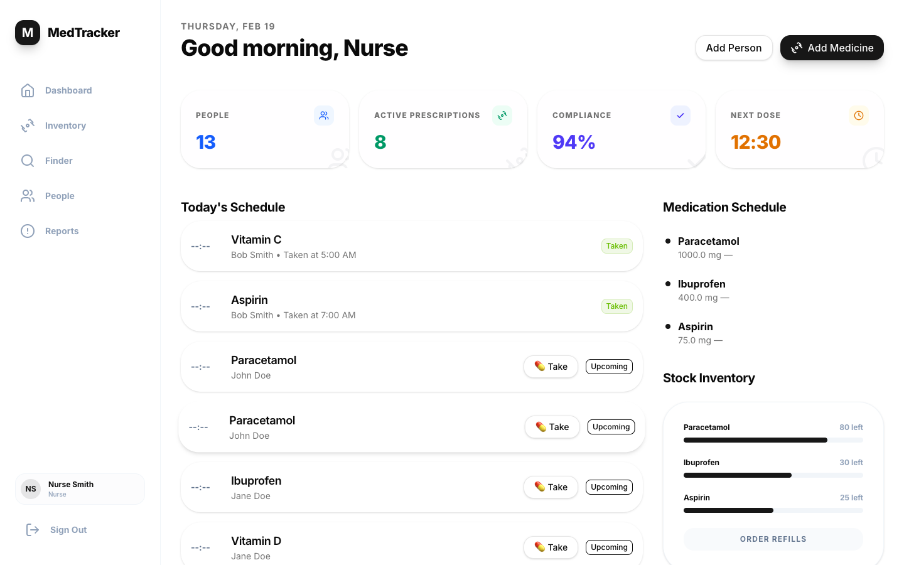

# MedTracker

[](https://github.com/damacus/med-tracker/actions/workflows/ci.yml)
[](https://github.com/damacus/med-tracker/releases)
[](LICENSE)

MedTracker is an open-source, self-hosted medication tracker for individuals,
families, and carers. It supports household medication schedules, dose
recording, stock tracking, reminders, and auditable history.

> [!IMPORTANT]
> MedTracker is currently in beta. It should supplement—not replace—your
> existing medication routine. Do not depend on it for clinical decisions,
> emergency information, or your sole medication reminders.



## Why MedTracker?

Medication management is rarely just a list of pills. When care is shared,
families need to know what is due, what has already happened, whether supplies
are running low, and who recorded each action. MedTracker brings that context
together without handing control of it to a hosted service.

- See today's medication routine for everyone you care for in one place
- Replace "has anyone given this?" guesswork with a clear dose history
- Spot low stock before it becomes a last-minute problem
- Coordinate care for children, dependent adults, and other household members
- Keep an attributable record of who did what and when
- Run MedTracker on infrastructure you control

## Try the self-hosted beta

We are looking for technically confident self-hosters who are willing to deploy
MedTracker, try the journey from household setup to recording doses, and tell us
where it is confusing or unreliable.

For a private local evaluation:

```shell
git clone https://github.com/damacus/med-tracker.git
cd med-tracker
task dev:up
task dev:seed
```

Open <http://localhost:3000>. Development seed data contains sample accounts
with known passwords, so never expose a seeded development instance to a public
or shared network.

Read the [self-hosting guide](https://damacus.github.io/med-tracker/self-hosting/)
before starting, and use the
[deployment guide](https://damacus.github.io/med-tracker/deployment/) for a
production-style installation.

## Share feedback

GitHub is the main home for MedTracker feedback:

- [Start a Discussion](https://github.com/damacus/med-tracker/discussions) for
  questions, early impressions, and self-hosting help
- [Report a bug or request a feature](https://github.com/damacus/med-tracker/issues/new/choose)
  using the short guided forms
- [Report a security vulnerability privately](https://github.com/damacus/med-tracker/security/advisories/new)

Please do not include names, medication details, health information, credentials,
tokens, or unredacted logs in public issues or discussions.

## Client Tools

First-party Rust tools live under `client-tools/`:

- `medtracker`: CLI for `/api/v1` workflows.
- `medtracker-mcp`: stdio MCP server for agent clients.

Run local tool gates with `task client-tools:fmt`,
`task client-tools:check`, `task client-tools:clippy`, and
`task client-tools:test`.

## Documentation

Published docs: <https://damacus.github.io/med-tracker/>

Key pages:

- [Quick Start](https://damacus.github.io/med-tracker/quick-start/)
- [Glossary](docs/glossary.md)
- [LLM Context Index (llms.txt)](https://damacus.github.io/med-tracker/llms.txt)
- [Kubernetes User Seeding](https://damacus.github.io/med-tracker/kubernetes-user-seeding/)
- [Carer Onboarding: First Dose](https://damacus.github.io/med-tracker/user-onboarding-carer-first-dose/)
- [Testing](https://damacus.github.io/med-tracker/testing/)
- [Client Tools](docs/api/client-tools.md)
- [Design](https://damacus.github.io/med-tracker/design/)
- [User Management](https://damacus.github.io/med-tracker/user-management/)

### Build docs locally

```bash
pip install -r requirements.txt
task docs:serve
```

## Contributing

See [CONTRIBUTING.md](CONTRIBUTING.md) for setup instructions, development
workflow, and coding standards.
