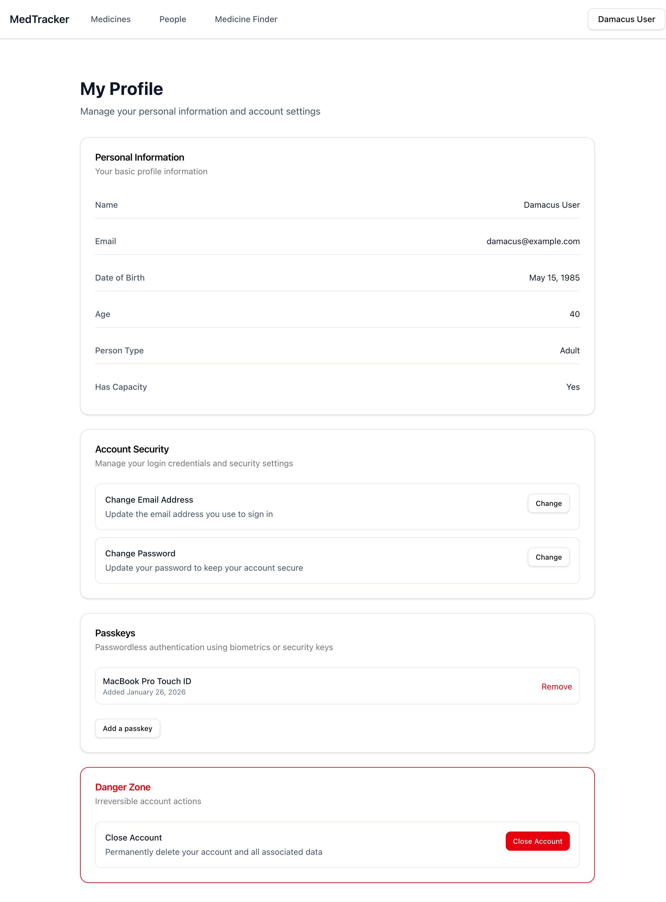

# Passkey Management UI Screenshots

Screenshots of the new passkey management functionality added to the profile page.

## Feature Overview

The passkey management feature allows users to:

- View their registered passkeys
- Add new passkeys for passwordless authentication
- Remove existing passkeys
- See when each passkey was added

## Screenshots

### 1. Empty State - No Passkeys Registered


**Location:** Profile page → Passkeys section

**What it shows:**

- The Passkeys card with title and description
- Empty state message: "No passkeys registered"
- Helper text: "Add a passkey for passwordless login"
- "Add a passkey" button

**Test scenario:** `spec/features/authentication/passkey_registration_spec.rb:13`

```ruby
scenario 'User with no passkeys sees empty state' do
  visit profile_path

  expect(page).to have_content('Passkeys')
  expect(page).to have_content('No passkeys registered')
end
```

### 2. Passkey List - With Registered Passkey



**Location:** Profile page → Passkeys section

**What it shows:**

- The Passkeys card with a registered passkey
- Passkey nickname: "MacBook Pro Touch ID"
- Registration date: "Added January 26, 2026"
- "Remove" button (red text) for deleting the passkey
- "Add a passkey" button for adding additional passkeys

**Test scenario:** `spec/features/authentication/passkey_registration_spec.rb:20`

```ruby
scenario 'User with passkeys sees list of registered passkeys' do
  account.account_webauthn_keys.create!(
    webauthn_id: 'test-credential-id',
    public_key: 'test-public-key',
    sign_count: 0,
    nickname: 'My MacBook'
  )

  visit profile_path

  expect(page).to have_content('My MacBook')
end
```

## Implementation Details

### Components

- **PasskeysCard** (`app/views/profiles/passkeys_card.rb`): Extracted component for passkey management
- **Profile Show** (`app/views/profiles/show.rb`): Main profile page that includes the PasskeysCard

### Security Features Verified

All 12 passkey security features (PASSKEY-SEC-001 through PASSKEY-SEC-012) have been implemented and tested:

- ✅ WebAuthn attestation verification
- ✅ Challenge-based replay attack prevention
- ✅ Origin validation for phishing prevention
- ✅ User verification (biometric/PIN) required
- ✅ Cryptographically unique credential IDs
- ✅ Public key cryptography (no private key storage)
- ✅ Counter validation for clone detection
- ✅ Timeout protection (120 seconds)
- ✅ Resident credential protection
- ✅ Authenticated passkey removal
- ✅ Transport-specific security
- ✅ Phishing-resistant authentication

### Test Coverage

- **37 passing tests** covering passkey functionality
- Feature specs for UI behavior
- Request specs for API endpoints
- Service specs for security features

## Related Issues

**Closed in this implementation:**

- PASSKEY-002: Passkey registration UI
- PASSKEY-SEC-001 through PASSKEY-SEC-012: Security verification tests

**Remaining work:**

- PASSKEY-003: Passkey login flow
- PASSKEY-005: Add additional passkeys from settings
- PASSKEY-006: Remove passkeys (UI interaction)
- PASSKEY-007: Password + passkey combination
- PASSKEY-009: Discoverable credentials
- PASSKEY-010: User verification for sensitive operations
