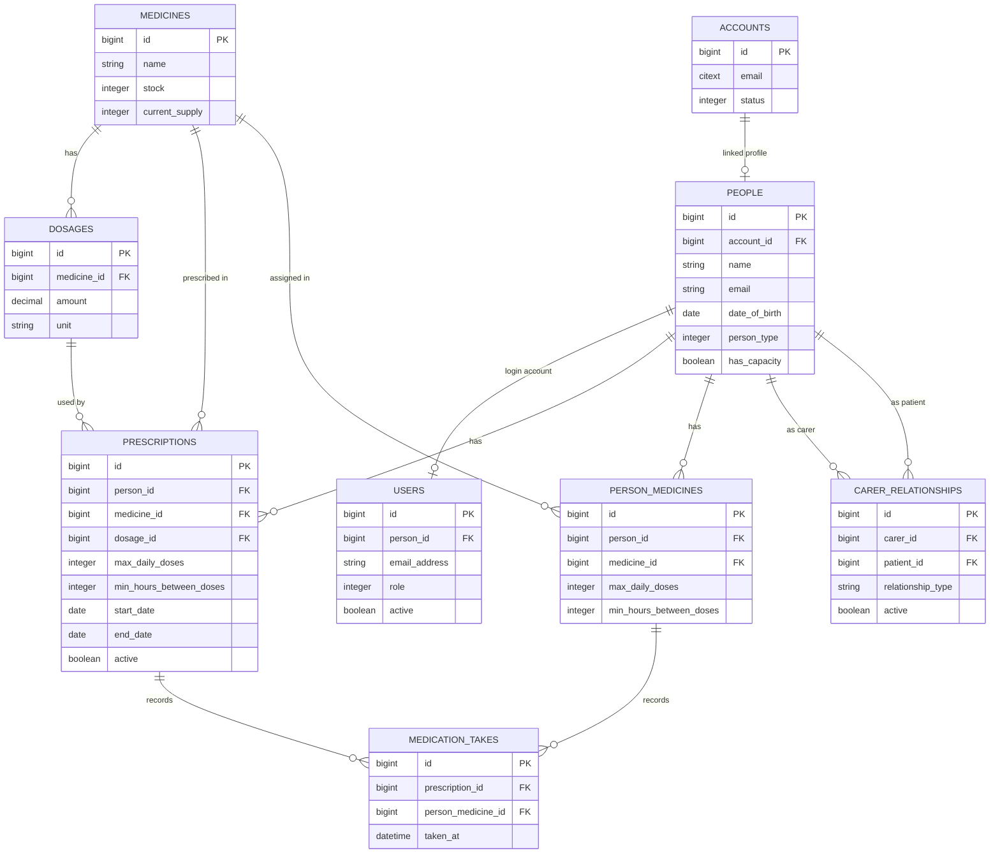

# Database Relationships

This diagram focuses on the core medication and care domain tables.

## Notes

- `MedicationTake` must reference exactly one source (`prescription_id` or
  `person_medicine_id`) at the model layer.
- Carer relationships are self-referential links on `people`.
