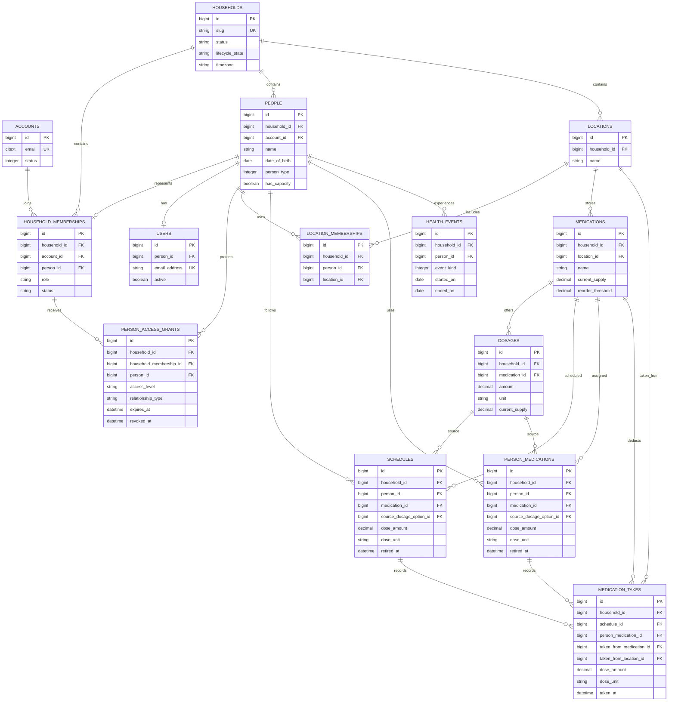

# Core Database Relationships

This guide shows the main household, access, medication, and care records. The
database schema remains the authority for columns, constraints, and indexes.

```mermaid
erDiagram
    ACCOUNTS {
      bigint id PK
      citext email UK
      integer status
    }

    HOUSEHOLDS {
      bigint id PK
      string slug UK
      string status
      string lifecycle_state
      string timezone
    }

    HOUSEHOLD_MEMBERSHIPS {
      bigint id PK
      bigint household_id FK
      bigint account_id FK
      bigint person_id FK
      string role
      string status
    }

    PEOPLE {
      bigint id PK
      bigint household_id FK
      bigint account_id FK
      string name
      date date_of_birth
      integer person_type
      boolean has_capacity
    }

    USERS {
      bigint id PK
      bigint person_id FK
      string email_address UK
      boolean active
    }

    PERSON_ACCESS_GRANTS {
      bigint id PK
      bigint household_id FK
      bigint household_membership_id FK
      bigint person_id FK
      string access_level
      string relationship_type
      datetime expires_at
      datetime revoked_at
    }

    LOCATIONS {
      bigint id PK
      bigint household_id FK
      string name
    }

    LOCATION_MEMBERSHIPS {
      bigint id PK
      bigint household_id FK
      bigint person_id FK
      bigint location_id FK
    }

    MEDICATIONS {
      bigint id PK
      bigint household_id FK
      bigint location_id FK
      string name
      decimal current_supply
      decimal reorder_threshold
    }

    DOSAGES {
      bigint id PK
      bigint household_id FK
      bigint medication_id FK
      decimal amount
      string unit
      decimal current_supply
    }

    SCHEDULES {
      bigint id PK
      bigint household_id FK
      bigint person_id FK
      bigint medication_id FK
      bigint source_dosage_option_id FK
      decimal dose_amount
      string dose_unit
      datetime retired_at
    }

    PERSON_MEDICATIONS {
      bigint id PK
      bigint household_id FK
      bigint person_id FK
      bigint medication_id FK
      bigint source_dosage_option_id FK
      decimal dose_amount
      string dose_unit
      datetime retired_at
    }

    MEDICATION_TAKES {
      bigint id PK
      bigint household_id FK
      bigint schedule_id FK
      bigint person_medication_id FK
      bigint taken_from_medication_id FK
      bigint taken_from_location_id FK
      decimal dose_amount
      string dose_unit
      datetime taken_at
    }

    HEALTH_EVENTS {
      bigint id PK
      bigint household_id FK
      bigint person_id FK
      integer event_kind
      date started_on
      date ended_on
    }

    ACCOUNTS ||--o{ HOUSEHOLD_MEMBERSHIPS : joins
    HOUSEHOLDS ||--o{ HOUSEHOLD_MEMBERSHIPS : contains
    HOUSEHOLDS ||--o{ PEOPLE : contains
    PEOPLE ||--o| HOUSEHOLD_MEMBERSHIPS : represents
    PEOPLE ||--o| USERS : has
    HOUSEHOLD_MEMBERSHIPS ||--o{ PERSON_ACCESS_GRANTS : receives
    PEOPLE ||--o{ PERSON_ACCESS_GRANTS : protects
    HOUSEHOLDS ||--o{ LOCATIONS : contains
    PEOPLE ||--o{ LOCATION_MEMBERSHIPS : uses
    LOCATIONS ||--o{ LOCATION_MEMBERSHIPS : includes
    LOCATIONS ||--o{ MEDICATIONS : stores
    MEDICATIONS ||--o{ DOSAGES : offers
    PEOPLE ||--o{ SCHEDULES : follows
    PEOPLE ||--o{ PERSON_MEDICATIONS : uses
    MEDICATIONS ||--o{ SCHEDULES : scheduled
    MEDICATIONS ||--o{ PERSON_MEDICATIONS : assigned
    DOSAGES ||--o{ SCHEDULES : source
    DOSAGES ||--o{ PERSON_MEDICATIONS : source
    SCHEDULES ||--o{ MEDICATION_TAKES : records
    PERSON_MEDICATIONS ||--o{ MEDICATION_TAKES : records
    MEDICATIONS ||--o{ MEDICATION_TAKES : deducts
    LOCATIONS ||--o{ MEDICATION_TAKES : taken_from
    PEOPLE ||--o{ HEALTH_EVENTS : experiences
```

## Household boundary

Core care records carry `household_id`. Composite foreign keys and row-level
security keep linked records in the same household. Code that reads or writes a
care record must establish the current household before querying it.

An account can join more than one household through `HouseholdMembership`.
Household roles are stored on that membership, not on `User`.

## People and access

`Person` holds the health record. `Account` holds authentication data. A
membership can point to a person when the account represents that person.
`User` is the application profile linked to the person and does not contain a
role column.

`PersonAccessGrant` gives a membership view, record, or manage access to one
person. Active grants can expire or be revoked. Carer relationships supply the
relationship behind delegated grants but remain separate records.

## Medication plans and stock

`Medication` represents stock at one location. Its current supply and reorder
threshold are decimals.

`Dosage` stores a reusable dose option for a medication. A schedule or direct
person medication keeps its own dose snapshot and can retain the source dosage
option through `source_dosage_option_id`. It does not use a `dosage_id` column.

`Schedule` represents dated or recurring administration. `PersonMedication`
represents routine or as-needed use without a fixed schedule. Both records can
be retired without deleting their dose history.

## Medication takes

Every `MedicationTake` references exactly one administration source: a schedule
or a person medication. PostgreSQL enforces this with
`chk_medication_takes_exactly_one_source`.

The take stores a dose snapshot. It can also identify the medication and
location used for the stock deduction. This preserves the administration
record when the current plan or stock values later change.

## Related records

Health events belong to a person and household. Join records can link relevant
medications while keeping a name snapshot for historical display.

Audit, API sync, authentication, notification, support-access, and retention
tables are outside this core diagram. Refer to `db/schema.rb` and the relevant
domain guide when working in those areas.
