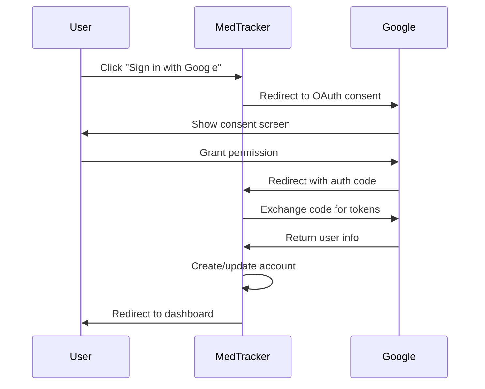

# OAuth Setup Guide

MedTracker supports OAuth authentication via Google, allowing users to sign in
with their existing Google accounts. This guide covers how to configure OAuth
for your deployment.

## Overview

OAuth authentication is handled by [Rodauth](https://rodauth.jeremyevans.net/)
with the [OmniAuth](https://github.com/omniauth/omniauth) integration. The
implementation supports:

- **Google OAuth 2.0** - Sign in with Google accounts
- **Automatic account creation** - New users are automatically registered
- **Profile synchronization** - Name and email are imported from Google

## Configuration

### Prerequisites

1. A Google Cloud Platform project
2. OAuth 2.0 credentials (Client ID and Client Secret)
3. Authorized redirect URIs configured in Google Cloud Console

### Setting Up Google OAuth Credentials

1. Go to the [Google Cloud Console](https://console.cloud.google.com/)
2. Create a new project or select an existing one
3. Navigate to **APIs & Services** → **Credentials**
4. Click **Create Credentials** → **OAuth client ID**
5. Select **Web application** as the application type
6. Configure the authorized redirect URIs:

    ```text
    # Development
    http://localhost:3000/auth/google_oauth2/callback

    # Production (replace with your domain)
    https://your-domain.com/auth/google_oauth2/callback
    ```

7. Copy the **Client ID** and **Client Secret**

### Configuring MedTracker

MedTracker supports two methods for providing OAuth credentials:

#### Option 1: Rails Credentials (Recommended for Production)

Store credentials securely using Rails encrypted credentials:

```bash
# Edit credentials
EDITOR="code --wait" bin/rails credentials:edit
```

Add the following structure:

```yaml
google:
  client_id: your-client-id.apps.googleusercontent.com
  client_secret: your-client-secret
```

#### Option 2: Environment Variables (Development/CI)

Set environment variables for simpler development setups:

```bash
export GOOGLE_CLIENT_ID="your-client-id.apps.googleusercontent.com"
export GOOGLE_CLIENT_SECRET="your-client-secret"
```

Or add to your `.env` file (if using dotenv):

```text
GOOGLE_CLIENT_ID=your-client-id.apps.googleusercontent.com
GOOGLE_CLIENT_SECRET=your-client-secret
```

!!! warning "Security Note"
    Never commit OAuth credentials to version control. Use Rails credentials
    or environment variables to keep them secure.

## How It Works

### Authentication Flow



### Account Creation

When a user signs in with Google for the first time, MedTracker automatically:

1. Creates an **Account** record for authentication
2. Creates a **Person** record with:
    - Name from Google profile
    - Email from Google account
    - Person type set to `adult`
    - Default date of birth (18 years ago)
3. Creates a **User** record with:
    - Role set to `parent`
    - Active status enabled

!!! note "Profile Updates"
    Users who sign up via OAuth can update their profile information
    (including date of birth) after registration.

### Existing Account Linking

If a user already has an account with the same email address, the OAuth
identity is linked to the existing account rather than creating a duplicate.

## Scopes

MedTracker requests the following OAuth scopes:

| Scope     | Purpose                          |
| --------- | -------------------------------- |
| `email`   | Access user's email address      |
| `profile` | Access user's name and photo URL |

## Troubleshooting

### Common Issues

#### "OAuth credentials not configured"

Ensure either Rails credentials or environment variables are set correctly.
Check that the credentials are accessible:

```ruby
# In Rails console
Rails.application.credentials.dig(:google, :client_id)
# or
ENV['GOOGLE_CLIENT_ID']
```

#### "Redirect URI mismatch"

The redirect URI in your Google Cloud Console must exactly match:

- Protocol (`http` vs `https`)
- Domain (including `www` if used)
- Port (if non-standard)
- Path (`/auth/google_oauth2/callback`)

#### "Access blocked: App not verified"

During development, you may see this warning. Options:

1. Add your test email to the test users list in Google Cloud Console
2. Complete Google's app verification process for production

### Debug Mode

Enable OmniAuth debug logging in development:

```ruby
# config/initializers/omniauth.rb
OmniAuth.config.logger = Rails.logger
```

## Security Considerations

### CSRF Protection

Rodauth's OmniAuth integration includes built-in CSRF protection. The OAuth
state parameter is validated to prevent cross-site request forgery attacks.

### Token Storage

OAuth tokens are not stored long-term. MedTracker only uses the OAuth flow
for initial authentication and account creation. Session management is
handled by Rodauth's remember feature.

### Credential Rotation

Periodically rotate your OAuth credentials:

1. Create new credentials in Google Cloud Console
2. Update MedTracker configuration
3. Test the new credentials
4. Delete the old credentials

## Adding Additional Providers

The Rodauth OmniAuth integration supports multiple providers. To add another
provider (e.g., GitHub, Microsoft):

1. Add the OmniAuth strategy gem to your Gemfile
2. Configure the provider in `app/misc/rodauth_main.rb`
3. Add the provider's callback route
4. Update the login view to include the new provider button

Example for adding GitHub:

```ruby
# Gemfile
gem 'omniauth-github'

# app/misc/rodauth_main.rb
omniauth_provider :github,
                  Rails.application.credentials.github[:client_id],
                  Rails.application.credentials.github[:client_secret],
                  scope: 'user:email'
```

## Related Documentation

- [User Management](user-management.md) - Roles and permissions
- [Architecture](design.md) - Overall system design
- [Rodauth Documentation](https://rodauth.jeremyevans.net/documentation.html)
- [OmniAuth Wiki](https://github.com/omniauth/omniauth/wiki)
