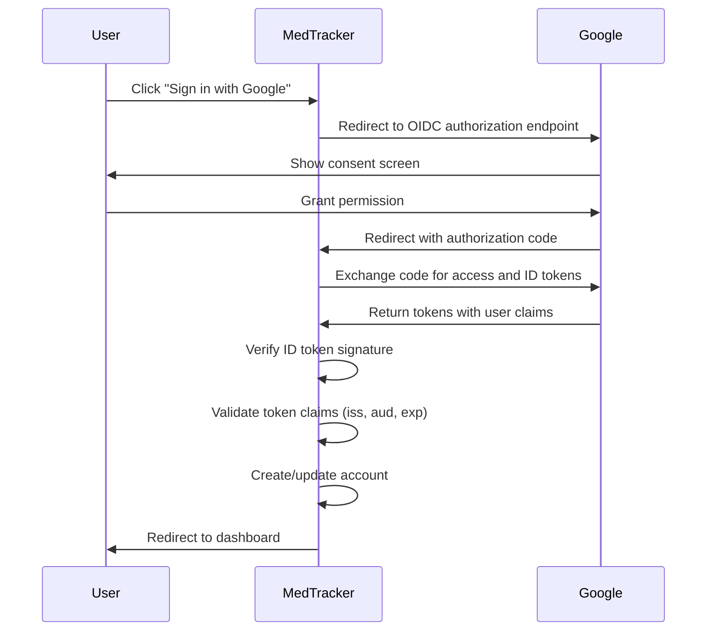

# OAuth/OIDC Setup Guide

MedTracker supports OpenID Connect (OIDC) authentication via Google OAuth 2.0,
allowing users to sign in with their existing Google accounts. This guide covers
how to configure OIDC for your deployment.

## Overview

OIDC authentication is handled by [Rodauth](https://rodauth.jeremyevans.net/)
with the [OmniAuth](https://github.com/omniauth/omniauth) integration. The
implementation supports:

- **Google OAuth 2.0 with OpenID Connect** - Secure sign-in with Google accounts
- **Automatic account creation** - New users are automatically registered
- **Profile synchronization** - Name and email are imported from OIDC claims
- **ID token verification** - Validates tokens using Google's public keys

## Configuration

### Prerequisites

1. A Google Cloud Platform project
2. OAuth 2.0 credentials (Client ID and Client Secret)
3. Authorized redirect URIs configured in Google Cloud Console

### Setting Up Google OAuth Credentials

1. Go to the [Google Cloud Console](https://console.cloud.google.com/)
2. Create a new project or select an existing one
3. Navigate to **APIs & Services** → **Credentials**
4. Click **Create Credentials** → **OAuth client ID**
5. Select **Web application** as the application type
6. Configure the authorized redirect URIs:

    ```text
    # Development
    http://localhost:3000/auth/google_oauth2/callback

    # Production (replace with your domain)
    https://your-domain.com/auth/google_oauth2/callback
    ```

7. Copy the **Client ID** and **Client Secret**

### Configuring MedTracker

MedTracker supports two methods for providing OAuth credentials:

#### Option 1: Rails Credentials (Recommended for Production)

Store credentials securely using Rails encrypted credentials:

```bash
# Edit credentials
EDITOR="code --wait" bin/rails credentials:edit
```

Add the following structure:

```yaml
google:
  client_id: your-client-id.apps.googleusercontent.com
  client_secret: your-client-secret
```

#### Option 2: Environment Variables (Development/CI)

Set environment variables for simpler development setups:

```bash
export GOOGLE_CLIENT_ID="your-client-id.apps.googleusercontent.com"
export GOOGLE_CLIENT_SECRET="your-client-secret"
```

Or add to your `.env` file (if using dotenv):

```text
GOOGLE_CLIENT_ID=your-client-id.apps.googleusercontent.com
GOOGLE_CLIENT_SECRET=your-client-secret
```

!!! warning "Security Note"
    Never commit OAuth credentials to version control. Use Rails credentials
    or environment variables to keep them secure.

## How It Works

### OpenID Connect (OIDC) vs OAuth 2.0

OIDC is an identity layer built on top of OAuth 2.0. While OAuth 2.0 is designed
for authorization (granting access to resources), OIDC adds authentication
(verifying user identity) with standardized identity tokens.

**Key OIDC features used in MedTracker:**

- **ID tokens** - JWT tokens containing verified user identity claims
- **UserInfo endpoint** - Standardized endpoint for retrieving user profile data
- **Email verification** - Google-verified email addresses (email_verified claim)
- **Standard scopes** - `openid`, `email`, and `profile` scopes

### Authentication Flow



### Account Creation

When a user signs in with Google for the first time, MedTracker automatically:

1. **Validates ID token** - Verifies token signature using Google's public keys
2. **Checks token claims** - Validates issuer, audience, and expiration
3. Creates an **Account** record for authentication with verified status
4. Creates a **Person** record with:
    - Name from OIDC `name` claim
    - Email from OIDC `email` claim (already verified by Google)
    - Person type set to `adult`
    - Default date of birth (100 years ago as sentinel value)
5. Creates a **User** record with:
    - Role set to `parent`
    - Active status enabled
6. Creates an **AccountIdentity** record linking the Google identity:
    - Provider: `google_oauth2`
    - UID: User's unique Google identifier (sub claim)

!!! note "Email Verification"
    Accounts created via OIDC are automatically marked as verified because
    Google has already verified the email address. The `email_verified` claim
    in the ID token confirms this.

### Existing Account Linking

If a user already has an account with the same email address, the OIDC identity
is linked to the existing account rather than creating a duplicate. The user can
subsequently login using either their password or Google sign-in.

## OIDC Scopes and Claims

MedTracker requests the following OIDC scopes:

| Scope     | Purpose                                    | Claims Provided                    |
| --------- | ------------------------------------------ | ---------------------------------- |
| `openid`  | Required for OIDC, enables ID token        | sub (unique user ID)               |
| `email`   | Access user's email address                | email, email_verified              |
| `profile` | Access user's basic profile information    | name, picture, given_name, family_name |

### ID Token Claims

The ID token returned by Google contains standard OIDC claims:

| Claim            | Description                                  | Example                                    |
| ---------------- | -------------------------------------------- | ------------------------------------------ |
| `iss`            | Issuer (Google)                              | `https://accounts.google.com`              |
| `sub`            | Subject (unique user identifier)             | `123456789012345678901`                    |
| `aud`            | Audience (your client_id)                    | `your-client-id.apps.googleusercontent.com`|
| `exp`            | Expiration time (Unix timestamp)             | `1702934400`                               |
| `iat`            | Issued at time (Unix timestamp)              | `1702930800`                               |
| `email`          | User's email address                         | `user@example.com`                         |
| `email_verified` | Whether Google verified the email            | `true`                                     |
| `name`           | Full name                                    | `John Doe`                                 |
| `picture`        | Profile picture URL                          | `https://lh3.googleusercontent.com/...`    |

## Scopes

## Troubleshooting

### Common Issues

#### "OAuth credentials not configured"

Ensure either Rails credentials or environment variables are set correctly.
Check that the credentials are accessible:

```ruby
# In Rails console
Rails.application.credentials.dig(:google, :client_id)
# or
ENV['GOOGLE_CLIENT_ID']
```

#### "Redirect URI mismatch"

The redirect URI in your Google Cloud Console must exactly match:

- Protocol (`http` vs `https`)
- Domain (including `www` if used)
- Port (if non-standard)
- Path (`/auth/google_oauth2/callback`)

#### "Access blocked: App not verified"

During development, you may see this warning. Options:

1. Add your test email to the test users list in Google Cloud Console
2. Complete Google's app verification process for production

### Debug Mode

Enable OmniAuth debug logging in development:

```ruby
# config/initializers/omniauth.rb
OmniAuth.config.logger = Rails.logger
```

## Security Considerations

### ID Token Verification

MedTracker validates ID tokens to ensure authenticity:

1. **Signature verification** - Tokens are signed JWTs verified using Google's public keys
2. **Issuer validation** - Verifies `iss` claim matches `https://accounts.google.com`
3. **Audience validation** - Verifies `aud` claim matches configured `client_id`
4. **Expiration check** - Verifies `exp` claim is in the future
5. **Email verification** - Checks `email_verified` claim is true

### CSRF Protection

Rodauth's OmniAuth integration includes built-in CSRF protection via the OAuth
`state` parameter. The state is:

- Generated randomly for each authentication request
- Stored in the session
- Validated when Google redirects back to the callback URL
- Single-use to prevent replay attacks

### Authorization Code Flow

MedTracker uses the **authorization code flow** (not the implicit flow) for
security best practices:

1. Client receives authorization code (not tokens) in redirect
2. Authorization code is exchanged server-side for tokens
3. Tokens are never exposed in browser URL or history
4. Client secret is required for token exchange

### Token Storage

OAuth access tokens and ID tokens are not stored long-term. MedTracker:

- Uses the access token only for the immediate UserInfo request
- Validates and extracts claims from the ID token
- Stores only the provider name and user's unique identifier (sub claim)
- Session management is handled by Rodauth's remember feature

This minimizes security risk if the database is compromised.

### Credential Rotation

Periodically rotate your OAuth credentials:

1. Create new credentials in Google Cloud Console
2. Update MedTracker configuration
3. Test the new credentials
4. Delete the old credentials

## Adding Additional Providers

The Rodauth OmniAuth integration supports multiple OIDC providers. To add another
provider (e.g., GitHub, Microsoft Azure AD, Okta):

1. Add the OmniAuth strategy gem to your Gemfile
2. Configure the provider in `app/misc/rodauth_main.rb`
3. The callback route is automatically created by Rodauth
4. Update the login view to include the new provider button

Example for adding Microsoft Azure AD (OIDC):

```ruby
# Gemfile
gem 'omniauth-microsoft_graph'

# app/misc/rodauth_main.rb
omniauth_provider :microsoft_graph,
                  Rails.application.credentials.microsoft[:client_id],
                  Rails.application.credentials.microsoft[:client_secret],
                  scope: 'openid email profile'
```

Example for adding GitHub (OAuth 2.0):

```ruby
# Gemfile
gem 'omniauth-github'

# app/misc/rodauth_main.rb
omniauth_provider :github,
                  Rails.application.credentials.github[:client_id],
                  Rails.application.credentials.github[:client_secret],
                  scope: 'user:email'
```

## OIDC vs OAuth 2.0

While this document uses both terms, it's important to understand the distinction:

- **OAuth 2.0** is an authorization framework for granting access to resources
- **OpenID Connect (OIDC)** is an identity layer on top of OAuth 2.0 for authentication

Google's implementation supports both OAuth 2.0 (for API access) and OIDC
(for user authentication). MedTracker uses OIDC features:

- ID tokens (JWT) containing verified identity claims
- Standardized endpoints and claim names
- Email verification via `email_verified` claim
- UserInfo endpoint for profile data

## Related Documentation

- [User Management](user-management.md) - Roles and permissions
- [Architecture](design.md) - Overall system design
- [Rodauth Documentation](https://rodauth.jeremyevans.net/documentation.html)
- [OmniAuth Wiki](https://github.com/omniauth/omniauth/wiki)
