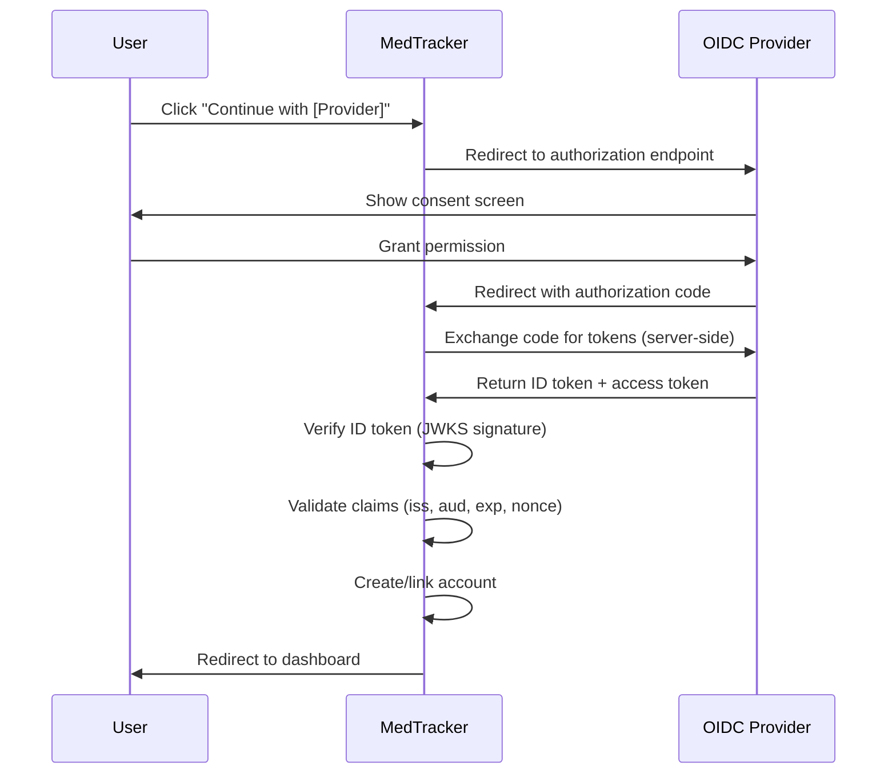

# OpenID Connect (OIDC) Setup Guide

MedTracker supports authentication via any OpenID Connect provider (Zitadel,
Keycloak, Authentik, Google, Azure AD, etc.) using the `omniauth_openid_connect`
gem with automatic provider discovery.

## Overview

OIDC authentication is handled by [Rodauth](https://rodauth.jeremyevans.net/)
with the [OmniAuth](https://github.com/omniauth/omniauth) integration. The
implementation supports:

- **Any OIDC-compliant provider** via `.well-known/openid-configuration` discovery
- **Authorization code flow** for secure server-side token exchange
- **Automatic account creation** with profile synchronization from OIDC claims
- **ID token verification** using provider JWKS (JSON Web Key Set)

## Configuration

### Required Environment Variables

```bash
OIDC_ISSUER_URL=https://your-provider.com    # Discovery endpoint base URL
OIDC_CLIENT_ID=your-client-id
OIDC_CLIENT_SECRET=your-client-secret
```

### Optional Environment Variables

```bash
OIDC_REDIRECT_URI=http://localhost:3000/auth/oidc/callback  # Auto-generated if not set
OIDC_PROVIDER_NAME="Your Identity Provider"                  # Defaults to "OIDC"
APP_URL=http://localhost:3000                                # Used for redirect URI
```

### Option 1: Rails Credentials (Recommended for Production)

```bash
EDITOR="code --wait" bin/rails credentials:edit
```

Add the following structure:

```yaml
oidc:
  issuer_url: https://your-provider.com
  client_id: your-client-id
  client_secret: your-client-secret
```

### Option 2: Environment Variables (Development/CI)

Set environment variables directly or via a `.env` file (not tracked in git):

```bash
set -x OIDC_ISSUER_URL "https://your-provider.com"
set -x OIDC_CLIENT_ID "your-client-id"
set -x OIDC_CLIENT_SECRET "your-client-secret"
```

> **Security**: Never commit OIDC credentials to version control. Use Rails
> credentials or environment variables.

## Authentication Flow



## Account Creation

When a user signs in via OIDC for the first time, MedTracker automatically:

1. Validates the ID token signature using the provider's JWKS
2. Validates token claims (issuer, audience, expiration)
3. Creates an **Account** record with verified status
4. Creates a **Person** record from OIDC claims (name, email)
5. Creates a **User** record with default `parent` role
6. Creates an **AccountIdentity** record linking the OIDC identity (provider + sub)

Accounts created via OIDC are automatically verified since the provider has
already verified the email address.

## OIDC Scopes and Claims

| Scope     | Purpose                                 | Claims Provided                        |
| --------- | --------------------------------------- | -------------------------------------- |
| `openid`  | Required for OIDC, enables ID token     | sub (unique user ID)                   |
| `email`   | Access user's email address             | email, email_verified                  |
| `profile` | Access user's basic profile information | name, picture, given_name, family_name |

## Provider-Specific Setup

### Zitadel (Recommended for Local Development)

See [Zitadel Local Testing Guide](zitadel-local-testing.md).

### Keycloak

1. Create a new realm or use an existing one
2. Create a new client with **Client authentication** enabled
3. Set **Valid redirect URIs** to `http://localhost:3000/auth/oidc/callback`
4. Copy the client ID and secret
5. Set `OIDC_ISSUER_URL` to `https://keycloak.example.com/realms/your-realm`

### Authentik

1. Create a new OAuth2/OpenID Provider
2. Set redirect URI to `http://localhost:3000/auth/oidc/callback`
3. Copy the client ID and secret
4. Set `OIDC_ISSUER_URL` to `https://authentik.example.com/application/o/your-app/`

### Google

1. Go to [Google Cloud Console](https://console.cloud.google.com/)
2. Create OAuth 2.0 credentials (Web application)
3. Set redirect URI to `http://localhost:3000/auth/oidc/callback`
4. Set `OIDC_ISSUER_URL` to `https://accounts.google.com`

### Azure AD / Entra ID

1. Register an application in Azure Portal
2. Add redirect URI `http://localhost:3000/auth/oidc/callback`
3. Create a client secret
4. Set `OIDC_ISSUER_URL` to `https://login.microsoftonline.com/{tenant-id}/v2.0`

## Security

### Built-in Protections

The `omniauth_openid_connect` gem and Rodauth OmniAuth provide:

- **Token signature verification** via JWKS (automatic with discovery)
- **Issuer validation** — `iss` claim must match configured issuer
- **Audience validation** — `aud` claim must match client ID
- **Expiration validation** — expired tokens are rejected
- **State parameter** — CSRF protection via random state in session
- **Nonce** — replay attack prevention
- **Authorization code flow** — tokens never exposed in browser

### Credential Storage

- Production: Use Rails encrypted credentials (`credentials.yml.enc`)
- Development: Environment variables or `.env` file (gitignored)
- Client secrets are never logged or exposed in error messages

### Security Audit

Run the security audit script to verify your configuration:

```bash
ruby scripts/audit_oidc_security.rb
```

## Troubleshooting

### "OIDC issuer URL must use HTTPS"

The issuer URL must use HTTPS in production. HTTP is only allowed for
`localhost` during development.

### "Redirect URI mismatch"

The redirect URI registered with your provider must exactly match:

- Protocol (`http` vs `https`)
- Domain and port
- Path: `/auth/oidc/callback`

### Provider discovery fails

Verify the issuer URL serves a valid `.well-known/openid-configuration`:

```bash
curl -s https://your-provider.com/.well-known/openid-configuration | jq .
```

### Debug logging

```ruby
# config/initializers/omniauth.rb
OmniAuth.config.logger = Rails.logger
```

## Related Documentation

- [Architecture](design.md)
- [Zitadel Local Testing](zitadel-local-testing.md)
- [Rodauth Documentation](https://rodauth.jeremyevans.net/documentation.html)
- [omniauth_openid_connect](https://github.com/omniauth/omniauth_openid_connect)
