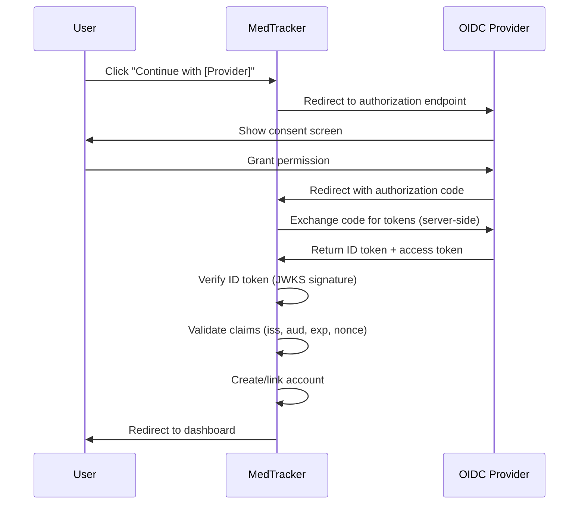

# OpenID Connect (OIDC) Setup Guide

MedTracker supports authentication via any OpenID Connect provider (Zitadel,
Keycloak, Authentik, Google, Azure AD, etc.) using the `omniauth_openid_connect`
gem with automatic provider discovery.

## Overview

OIDC authentication is handled by [Rodauth](https://rodauth.jeremyevans.net/)
with the [OmniAuth](https://github.com/omniauth/omniauth) integration. The
implementation supports:

- **Any OIDC-compliant provider** via `.well-known/openid-configuration` discovery
- **Authorization code flow** for secure server-side token exchange
- **Account linking and creation** subject to MedTracker's registration policy
- **ID token verification** using provider JWKS (JSON Web Key Set)

## Configuration

### Required Environment Variables

```bash
OIDC_ISSUER_URL=https://your-provider.com    # Discovery endpoint base URL
OIDC_CLIENT_ID=your-client-id
OIDC_CLIENT_SECRET=your-client-secret
```

### Optional Environment Variables

```dotenv
APP_URL=https://medtracker.example.com
OIDC_REDIRECT_URI=https://medtracker.example.com/auth/oidc/callback
OIDC_PROVIDER_NAME="Your Identity Provider"
```

`OIDC_REDIRECT_URI` defaults to `${APP_URL}/auth/oidc/callback`.

### Local development with Portless

Register this callback with the provider:

`https://med-tracker.localhost/auth/oidc/callback`

Export the local URLs before starting the development container so OIDC sees
the same stable origin as the browser:

```fish
set -x APP_URL "https://med-tracker.localhost"
set -x OIDC_REDIRECT_URI "https://med-tracker.localhost/auth/oidc/callback"
set -x OIDC_ISSUER_URL "https://your-provider.com"
set -x OIDC_CLIENT_ID "your-client-id"
set -x OIDC_CLIENT_SECRET "your-client-secret"
task dev:portless
```

### Option 1: Rails Credentials (Recommended for Production)

```bash
EDITOR="code --wait" bin/rails credentials:edit
```

Add the following structure:

```yaml
oidc:
  issuer_url: https://your-provider.com
  client_id: your-client-id
  client_secret: your-client-secret
```

### Option 2: Environment Variables (Development/CI)

Set environment variables directly or via a `.env` file (not tracked in git):

```bash
set -x OIDC_ISSUER_URL "https://your-provider.com"
set -x OIDC_CLIENT_ID "your-client-id"
set -x OIDC_CLIENT_SECRET "your-client-secret"
```

> **Security**: Never commit OIDC credentials to version control. Use Rails
> credentials or environment variables.

## Authentication Flow


```mermaid
sequenceDiagram
    participant User
    participant MedTracker
    participant Provider as OIDC Provider

    User->>MedTracker: Click "Continue with [Provider]"
    MedTracker->>Provider: Redirect to authorization endpoint
    Provider->>User: Show consent screen
    User->>Provider: Grant permission
    Provider->>MedTracker: Redirect with authorization code
    MedTracker->>Provider: Exchange code for tokens (server-side)
    Provider->>MedTracker: Return ID token + access token
    MedTracker->>MedTracker: Verify ID token (JWKS signature)
    MedTracker->>MedTracker: Validate claims (iss, aud, exp, nonce)
    MedTracker->>MedTracker: Create/link account
    MedTracker->>User: Redirect to dashboard
```

## Account Creation

MedTracker validates the provider identity and links it to an existing account
with the same email when appropriate. New OIDC accounts are subject to the
configured registration policy. When invitation-only registration is enabled,
uninvited identities cannot create accounts through single sign-on.

Household roles and person-level access remain controlled by MedTracker; they
are not granted from arbitrary provider role claims.

## OIDC Scopes and Claims

| Scope     | Purpose                                 | Claims Provided                        |
| --------- | --------------------------------------- | -------------------------------------- |
| `openid`  | Required for OIDC, enables ID token     | sub (unique user ID)                   |
| `email`   | Access user's email address             | email, email_verified                  |
| `profile` | Access user's basic profile information | name, picture, given_name, family_name |

## Provider-Specific Setup

### Zitadel (Recommended for Local Development)

See [Zitadel Local Testing Guide](zitadel-local-testing.md).

### Keycloak

1. Create a new realm or use an existing one
2. Create a new client with **Client authentication** enabled
3. Set **Valid redirect URIs** to `${APP_URL}/auth/oidc/callback`
4. Copy the client ID and secret
5. Set `OIDC_ISSUER_URL` to `https://keycloak.example.com/realms/your-realm`

### Authentik

1. Create a new OAuth2/OpenID Provider
2. Set redirect URI to `${APP_URL}/auth/oidc/callback`
3. Copy the client ID and secret
4. Set `OIDC_ISSUER_URL` to `https://authentik.example.com/application/o/your-app/`

### Google

1. Go to [Google Cloud Console](https://console.cloud.google.com/)
2. Create OAuth 2.0 credentials (Web application)
3. Set redirect URI to `${APP_URL}/auth/oidc/callback`
4. Set `OIDC_ISSUER_URL` to `https://accounts.google.com`

### Azure AD / Entra ID

1. Register an application in Azure Portal
2. Add redirect URI `${APP_URL}/auth/oidc/callback`
3. Create a client secret
4. Set `OIDC_ISSUER_URL` to `https://login.microsoftonline.com/{tenant-id}/v2.0`

## Security

### Built-in Protections

The `omniauth_openid_connect` gem and Rodauth OmniAuth provide:

- **Token signature verification** via JWKS (automatic with discovery)
- **Issuer validation** — `iss` claim must match configured issuer
- **Audience validation** — `aud` claim must match client ID
- **Expiration validation** — expired tokens are rejected
- **State parameter** — CSRF protection via random state in session
- **Nonce** — replay attack prevention
- **Authorization code flow** — tokens never exposed in browser

### Credential Storage

- Production: Use Rails encrypted credentials (`credentials.yml.enc`)
- Development: Environment variables or `.env` file (gitignored)
- Client secrets are never logged or exposed in error messages

### Security Audit

Run the security audit script to verify your configuration:

```bash
ruby scripts/audit_oidc_security.rb
```

## Troubleshooting

### "OIDC issuer URL must use HTTPS"

The issuer URL must use HTTPS in production. HTTP is only allowed for
`localhost` during development.

### "Redirect URI mismatch"

The redirect URI registered with your provider must exactly match:

- Protocol (`http` vs `https`)
- Domain and port
- Path: `/auth/oidc/callback`

### Provider discovery fails

Verify the issuer URL serves a valid `.well-known/openid-configuration`:

```bash
curl -s https://your-provider.com/.well-known/openid-configuration | jq .
```

### Debug logging

```ruby
# config/initializers/omniauth.rb
OmniAuth.config.logger = Rails.logger
```

## Related Documentation

- [Architecture](design.md)
- [Zitadel Local Testing](zitadel-local-testing.md)
- [Rodauth Documentation](https://rodauth.jeremyevans.net/documentation.html)
- [omniauth_openid_connect](https://github.com/omniauth/omniauth_openid_connect)
